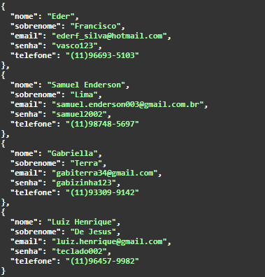
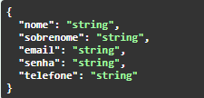
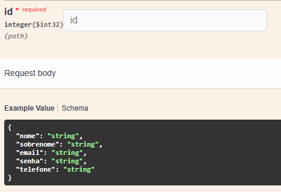
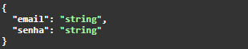

<h1 align="center">API CRUD com Validação de Login</h1>

<!-- Descrição -->

Esta é uma API que fornece operações básicas de CRUD (Create, Read, Update e Delete) para usuários, juntamente com um endpoint para validar o login de usuários.

<!-- Badges -->

  
  
  

<!-- Conteúdo -->
## :bookmark_tabs: Conteúdo

#### FUNCIONALIDADES:
> - CRUD (Create, Read, Update e Delete) de usuários.
> - Validação de login.

### CRUD de Usuários

- **Listar Usuários:**
  - **Descrição:** Retorna uma lista de todos os usuários cadastrados.
  - **Endpoint:** `GET /api/User`
  - **Códigos de Status:**
    - :white_check_mark: 200 (OK) - Sucesso.
    - :x: 404 (Not Found) - Usuários não encontrados.
    
    

- **Adicionar Usuário:**
  - **Descrição:** Adiciona um novo usuário.
  - **Endpoint:** `POST /api/User`
  - **Códigos de Status:**
    - :white_check_mark: 200 (OK) - Sucesso.
    - :warning: 400 (Bad Request) - Dados de entrada inválidos.

    

- **Atualizar Usuário:**
  - **Descrição:** Atualiza os dados de um usuário existente, informando o ID.
  - **Endpoint:** `PUT /api/User/{id}`
  - **Códigos de Status:**
    - :white_check_mark: 200 (OK) - Sucesso.
    - :x: 404 (Not Found) - Usuário não encontrado.

    

- **Excluir Usuário:**
  - **Descrição:** Exclui um usuário existente.
  - **Endpoint:** `DELETE /api/User/{id}`
  - **Códigos de Status:**
    - :white_check_mark: 200 (OK) - Sucesso.
    - :x: 404 (Not Found) - Usuário não encontrado.

---

### Validação de Login

- **Login de Usuário:**
  - **Descrição:** Valida as credenciais de login de um usuário.
  - **Endpoint:** `POST /api/Login/login`
  - **Códigos de Status:**
    - :white_check_mark: 200 (OK) - Sucesso.
    - :x: 400 (Bad Request) - Usuário não encontrado ou senha incorreta.

    

    

<!-- Instruções de uso do projeto -->

## :busts_in_silhouette: Integrantes

> 
>**INTEGRANTES**  
> Nome: Eduardo Fagundes Correa | RM: 97195  
> Nome: Murilo Ariel Reis | RM: 97002  
> Nome: Luiz Henrique de Jesus do Nascimento | RM: 96335  
> Nome: Samuel Enderson Lima da Silva | RM: 96677  

---

<!-- Rodapé -->

  Built with ❤️ by Your Team

